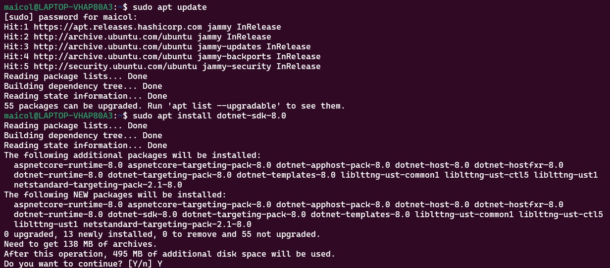

# Taller Práctico de Docker – Despliegue de una Aplicación Web

## Objetivo

Familiarizarse con los conceptos fundamentales de Docker y aprender a desplegar una aplicación web simple utilizando contenedores.

## Descripción

En este taller aprenderemos a:

- Instalar y verificar Docker.
- Descargar y ejecutar una imagen Docker (Hello World).
- Crear y desplegar una aplicación web usando .NET 8.0 en un contenedor Docker.
- Subir la imagen a Docker Hub y compartirla.

## Pasos Realizados

### 1. Verificación de la instalación de Docker


**Comando:** 
```bash
docker --version
```

Verificamos que Docker esté correctamente instalado. Este comando muestra la versión actual de Docker instalada en el sistema.

### 2. Descargar la imagen de Hello World


**Comando:** 
```bash
docker pull hello-world
```

Descargamos la imagen oficial de Docker llamada `hello-world`. Esta imagen es utilizada para comprobar que Docker funciona correctamente.

### 3. Ejecutar la imagen Hello World


**Comando:** 
```bash
docker run hello-world
```

Este comando ejecuta un contenedor basado en la imagen `hello-world`. Si la imagen no está en la máquina, Docker automáticamente la descarga antes de ejecutar el contenedor.

### 4. Actualización de paquetes y la instalación de .NET SDK



**Comando:** 
```bash
sudo apt update
sudo apt install dotnet-sdk-8.0
```

Actualizamos los paquetes instalados en el sistema operativo y luego instalamos el SDK de .NET 8.0 necesario para desarrollar y ejecutar aplicaciones .NET.

### 5. Creación de una aplicación web simple con .NET


**Comando:** 
```bash
dotnet new web -n MyWebApp
```

Creamos una aplicación web básica con .NET utilizando el comando `dotnet new web`. La aplicación se genera en una nueva carpeta llamada `MyWebApp`.

### 6. Creación del Dockerfile


**Comando:** 
```bash
nano dockerfile
```

El `Dockerfile` define las instrucciones para construir y ejecutar la aplicación en un contenedor Docker. Aquí utilizamos una imagen de .NET SDK para compilar el código y luego otra imagen más ligera de .NET ASP.NET para ejecutar la aplicación.

```Dockerfile
    # Etapa de construcción
    FROM mcr.microsoft.com/dotnet/sdk:8.0 AS build  # Imagen SDK para compilar
    WORKDIR /app  # Establecer directorio de trabajo
    COPY . .  # Copiar todo al contenedor
    RUN dotnet restore  # Restaurar dependencias
    RUN dotnet publish -c Release -o out  # Publicar app en modo Release

    # Etapa de ejecución
    FROM mcr.microsoft.com/dotnet/aspnet:8.0  # Imagen runtime para ejecutar
    WORKDIR /app  # Establecer directorio de trabajo
    COPY --from=build /app/out .  # Copiar compilados de la etapa anterior
    ENTRYPOINT ["dotnet", "MyWebApp.dll"]  # Ejecutar la aplicación
```

### 7. Construcción de la imagen de la aplicación


**Comando:** 
```bash
docker build -t mywebapp:latest .
```

Utilizamos el comando `docker build` para crear una imagen Docker a partir del `Dockerfile` con el nombre `mywebapp:latest`.

### 8. Etiquetado de la imagen para Docker Hub


**Comando:** 
```bash
docker tag mywebapp:latest michael361/mywebapp:latest
```

Etiquetamos la imagen construida con el nombre de usuario de Docker Hub (`michael361`) para poder subirla al repositorio.

### 9. Iniciar sesión en Docker Hub


**Comando:** 
```bash
docker login -u michael361
```

Iniciamos sesión en Docker Hub para tener permisos de subir la imagen al repositorio.

### 10. Creación del repositorio en Docker Hub


Creamos un repositorio en Docker Hub con el mismo nombre que la imagen (`mywebapp`) para poder subir nuestra imagen.

### 11. Subir la imagen a Docker Hub


**Comando:** 
```bash
docker push michael361/mywebapp:latest
```

Usamos `docker push` para subir la imagen al repositorio de Docker Hub.

### 12. Ejecutar el contenedor desde Docker Hub


**Comando:** 
```bash
docker run -d -p 8080:8080 --name mywebapp_container michael361/mywebapp:latest
```

Ejecutamos el contenedor en segundo plano (`-d`) y mapeamos el puerto 8080 del contenedor al puerto 8080 del host. Este contenedor se nombra `mywebapp_container`.

### 13. Verificar contenedores en ejecución


**Comando:** 
```bash
docker ps
```

Utilizamos `docker ps` para verificar que el contenedor `mywebapp_container` está en ejecución.

### 14. Revisar los logs del contenedor


**Comando:** 
```bash
docker logs mywebapp_container
```

Este comando permite ver los mensajes de salida generados por el contenedor en ejecución, donde confirmamos que la aplicación se está ejecutando correctamente.

### 15. Verificar que la aplicación funcione


**Comando:** 
```bash
curl http://localhost:8080
```

Usamos `curl` para verificar que la aplicación responde correctamente desde el contenedor en la URL `localhost:8080`. El resultado es un mensaje "Hello World!".

### 16. Detener el contenedor


**Comando:** 
```bash
docker stop mywebapp_container
docker ps -a
```

Detenemos el contenedor con `docker stop` y verificamos que está efectivamente detenido con `docker ps -a`.

## Conclusión

Este taller nos permitió familiarizarnos con el uso de Docker para desplegar aplicaciones web simples. Además, aprendimos a crear y gestionar contenedores, construir imágenes y compartirlas en Docker Hub.